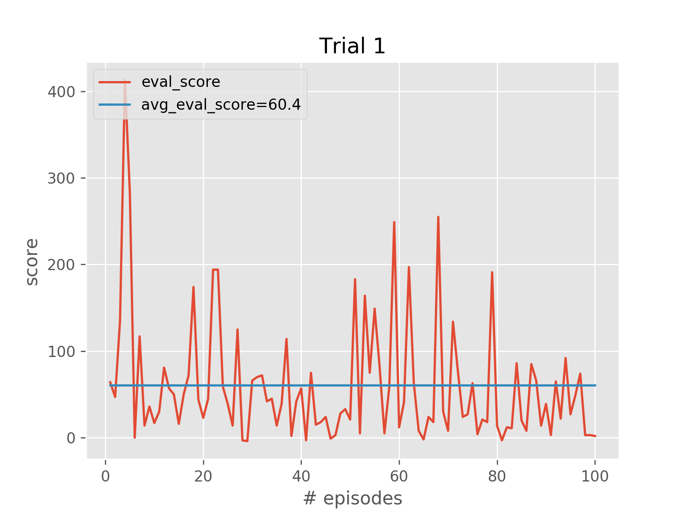

# FlappyBirdRL

A Deep Q-Learning RL agent for playing the Flappy Bird game.

## Overview
This project implements a Double Deep Q-Learning agent with Dueling network architecture
that learns to play the Flappy Bird game using the [PLE](https://pygame-learning-environment.readthedocs.io/en/latest/).

## Requirements
* [Tensorflow 2.x](https://www.tensorflow.org/install)
* [PLE](https://pygame-learning-environment.readthedocs.io/en/latest/user/home.html#installation)
* [Open CV](https://pypi.org/project/opencv-python/)

## Try it yourself
To train a new RL agent simply run `python train.py`

To evaluate a saved model use `python evaluate.py` (After updating the `RESULT_PATH`
and `EVAL_MODEL_PATH` with appropriate values)

## Training
The agent was trained using 4 grey-scale images each of size (84x84). Each action provided
by the agent was executed for 4 consecutive frames, this was done to speed up the learning 
process as predicting one action per frame was slowing down the learning process.

## Results
Following are the results obtained after training the model for ~5 M steps (parameter updates):

Score | Loss | Q-values
:-------------------------:|:-------------------------:|:-------------------------:
 |  | 

* The `train_score` and the `eval_score` are running average for last 100 episodes.

* All the q_values are running average for last 100 episodes.

## Evaluation

The final saved target model was used for evaluation. Following are the results:

  Trial 1| Trial 2 | Trial 3
 :-------------------------:|:-------------------------:|:-------------------------:
 |  | 
